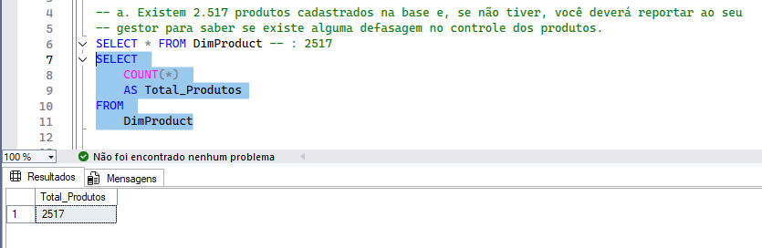
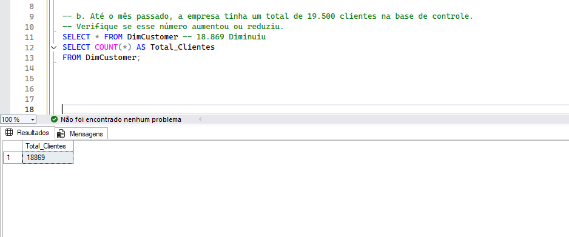
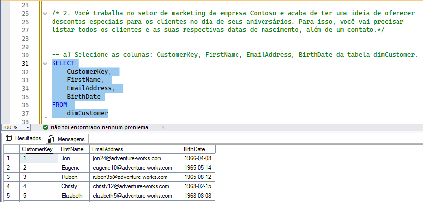
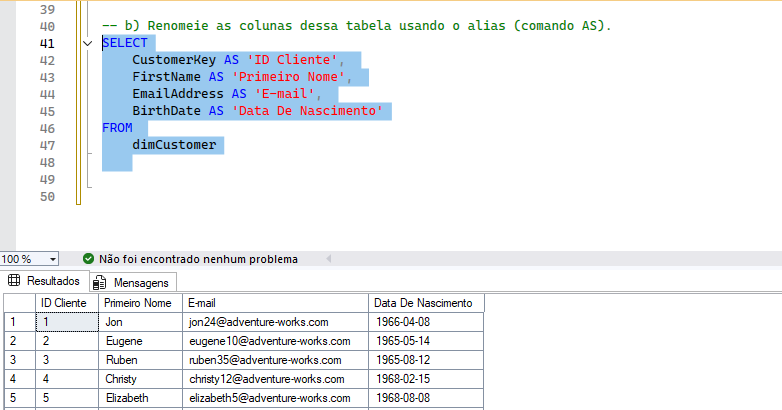

# Introdução ao SQL – Módulo 3
**Curso:** Alura – SQL Server: Introdução à Linguagem de Consulta  
**Autor:** Bertil Kenjiro  

---

## Descrição
Este módulo apresenta os comandos fundamentais da linguagem SQL, abordando operações de seleção e filtragem de dados.

Os exercícios foram desenvolvidos com o banco **ContosoRetailDW** no **SQL Server Management Studio (SSMS)**.

---

## Estrutura do Repositório
```
Introducao_SQL_Modulo3/
 ┣ README.md
 ┣ scripts/
 ┃ ┣ exercicio_01.sql
 ┃ ┣ exercicio_02.sql
 ┃ ┣ exercicio_03.sql
 ┃ ┣ exercicio_04.sql
 ┃ ┗ exercicio_05.sql
 ┣ resultados/
 ┃ ┣ exercicio_401_resultado_a.png
 ┃ ┣ exercicio_401_resultado_b.png
 ┃ ┣ exercicio_402_resultado_a.png
 ┃ ┣ exercicio_402_resultado_b.png
 ┗
```
## 📊 Exemplos de Resultados Visuais
## 🧩 Exemplo de Resultado

1. Abaixo, visualizamos o resultado da consulta do **Exercício 1**, que verifica a contagem total de produtos e clientes na base:




2. Abaixo, visualizamos o resultado da consulta do **Exercício 2**, que seleciona colunas e as renomeia utilizando a base de clientes:




3. Abaixo, visualizamos o resultado da consulta do **Exercício 3**, que se utiliza das mecânicas anteriores (SELECT, AS , TOP, TOP PERCENT) usando a base de vendas :


---

## Ambiente Utilizado
| Ferramenta | Versão | Observações |
| SQL Server Management Studio | 19.x | Execução das consultas |
| Banco de Dados | ContosoRetailDW | Base de treino |
| Editor | VS Code | Organização de scripts |

---

## Observações
- Todos os scripts seguem boas práticas de endentação e comentários.
- Resultados exportados estão em /resultados.

